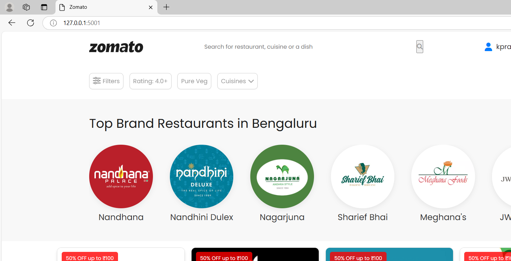
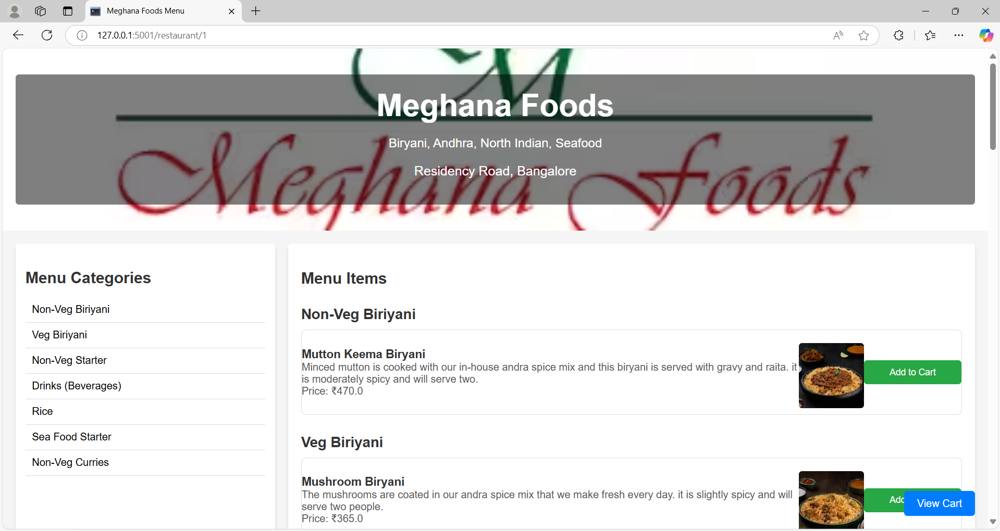
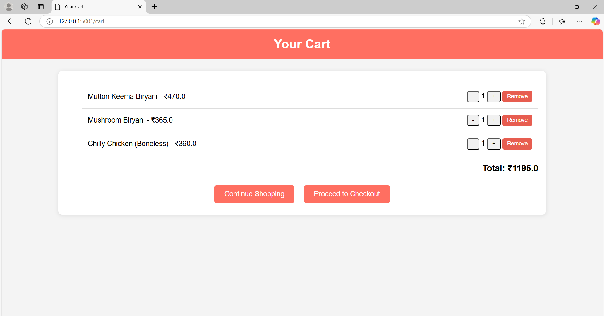
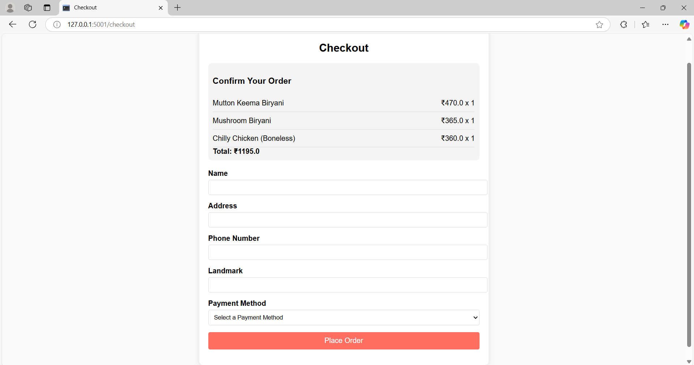

# Zomato Clone

## 📖 Project Explanation

This is a **Zomato Clone** — a simplified version of the popular food delivery app, built for learning purposes. The project demonstrates how to create an online restaurant listing and ordering system using **Django** as the backend framework.

### ✅ Key Features
- **User Authentication:** Users can sign up, log in, and manage their account.
- **Restaurant Listing:** Browse through a limited list of up to 50 restaurants.
- **Menu Viewing:** See detailed menus for each restaurant.
- **Order Placement:** Select menu items and place an order.
- **Order Confirmation:** Users receive confirmation once the order is placed.

### 🛠 Technologies Used
- **Backend:** Flask framework
- **Database:** SQLite (for storing user data, restaurants, menus, and orders)
- **Frontend:** HTML, CSS, and JavaScript.

### 🔍 How It Works
1. The user signs up or logs into the application.
2. Upon login, the user is shown a list of restaurants (limited to 50 for simplicity).
3. The user can click on a restaurant to view its menu items.
4. Menu items can be selected and added to an order.
5. The user can place the order, and an order confirmation is displayed.

### 📸 Screenshots

#### Restaurant Listing

Home page has the top restaurants listed with  offters/discounts

#### Restaurant Menu page

Menu Page lists the items in that particular Restaurants along with the price

#### Cart

#### Checkout Page

### 🚀 Future Enhancements
- Add payment gateway integration.
- Implement filters for cuisine, price, or ratings.
- Enhance UI with responsive design.
- Deploy the project to a live server.

---
